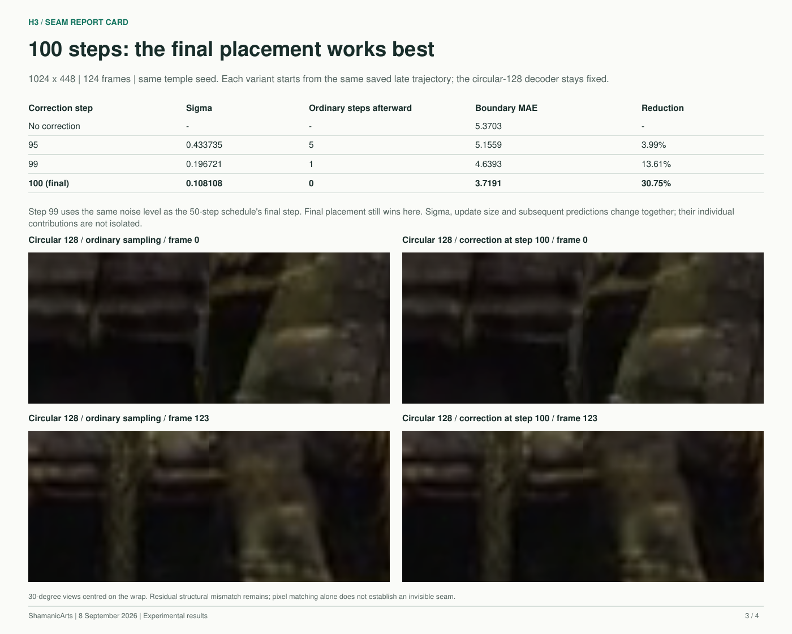
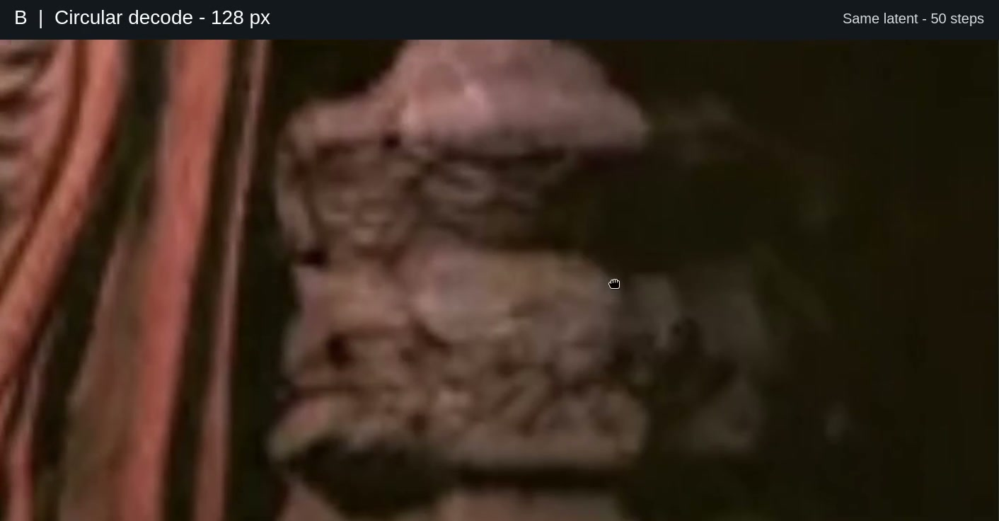

# H3 circular VAE decoding

Experimental v0.3: a configurable MiniMax H3 pipeline for equirectangular video. It combines circular VAE decoding, a final shifted prediction and optional small-mask repair at the top and bottom poles.

**[Endpoint interface and deployment](docs/service.md)** · **[Service validation](docs/service-validation.md)**

The decoder can also be used independently: decode the **same final video latent** natively, or with neighboring columns copied across the left/right boundary before decoding.

**New experiment: [final shifted prediction report card](docs/H3-final-prediction-report-card.pdf)** - circular decoding plus one seam-centred prediction at the final denoising step. Tested at 50 and 100 steps; [technique, timing and limits](docs/final-prediction.md). The actual sampler and T2V runtime are now included; see [deployment](docs/deployment.md).

[](docs/H3-final-prediction-report-card.pdf)

### Original decoder-only demonstration

[](docs/media/h3-seam-walkthrough.mp4)

**[Watch the comparison (24.5 s)](docs/media/h3-seam-walkthrough.mp4)** - A: native; B: circular 128. Watch the vertical join through the carving. Original playback speed; fixed-frame comparisons are in the PDF.

[Comparison PDF](docs/H3-circular-decoding-comparison.pdf) · [Technique](docs/technique.md) · [Measurements](docs/evidence.md) · [Reproduction](docs/reproduce.md) · [Changelog](CHANGELOG.md)

```text
final H3 video latent
  -> [right-hand columns | original latent | left-hand columns]
  -> native H3 VAE decode
  -> crop added margins
  -> complete ERP video at its original dimensions
```

At H3's 16x spatial compression, 128 px context means 8 latent columns per side; 384 px means 24. The wider canvas changes both the available context and the native decoder's tile layout. This is a decoder intervention, without an additional diffusion pass.

## Decoder-only visual comparisons

[Read the four-page comparison PDF](docs/H3-circular-decoding-comparison.pdf) for the full ERP context, technique, measurements and magnified views.

Same temple frame (97), centred on the wrap, at a 75-degree horizontal field of view. Left to right: native, circular 128, circular 384.

**Eye level**


**Looking up 45 degrees**


The [measurement page](docs/evidence.md) includes the downward view and both 20-degree close-ups. All views use matched projections of the saved PNG frames.

## Install and use

Install into an existing compatible PyTorch/ComfyUI model environment:

```sh
python -m pip install .
```

```python
import torch
from circular_decode import decode_circular

# Raw native MiniMaxH3VideoVAE, already loaded by the model environment.
# video_latent: video-only BCTHW tensor, in the raw VAE's normalization,
# on the decoder's device and dtype. Not a generic ComfyUI LATENT dictionary.
with torch.inference_mode():
    pixels = decode_circular(vae, video_latent, context_pixels=128)
```

For large videos, use the [CPU output-buffer example](examples/decode_saved_latent.py). The decoder callable itself has no weight-loading or cloud side effects. The optional [T2V runtime and fal bundle](docs/deployment.md) load the pinned models; there is no ComfyUI graph node yet. The raw decoder interface used in the experiments comes from ComfyUI revision `12d5279438bfefc058a269eae805ceab6047777f`.

## Evidence and scope

The matched forest and temple runs use 1536 x 672, 243 frames at 24 fps, 50 steps, BF16 H3 and our reviewed 360 LoRA at 1.0. Native VAE decoding uses FP16. In spherical review the join is visibly reduced, particularly in the temple. Boundary pixel mismatch falls about 28-31%; that is a diagnostic, not a percentage of perceptual improvement.

The original GPU harness produced the report-card results. The extracted wheel has geometry, sampler and CPU integration tests; a fresh full-model deployment validation is recorded in [release status](docs/release-status.md). It is an experimental source release, not a claim of universal seam removal. Refinement/upscaling, polar correctness and semantic consistency remain open.

```sh
python -m unittest discover -s tests -v
```

Install/use the model environment's PyTorch to run the complete test suite.

The Python wheel contains the decoder and native runtime modules, plus `service_schema`, `service_worker`, `polar_pipeline`, `polar_kernel` and `polar_geometry`. The coordinate-only `spherical_projection.py` is a separate polar research module; see the [polar experiment plan](docs/polar-research.md). Pole mappings in `spherical_context.py` and the separate `periodic_tiles.py` are experimental and are not used by `decode_circular`. The [optional viewer source](viewer/README.md) is separate from the adapter; its video assets are not in Git.

## Configurable fal service

The service combines native generation, circular decoding and optional
top/bottom pole repair in one repeatable endpoint. It also accepts an existing
ERP video for repair. Each repair prompt is separate from the generation prompt
and defaults to **“Repair the polar distortion.”** Outputs include the complete
ERP, an unrepaired comparison and exact-setting receipts.

See [the service interface and deployment guide](docs/service.md). The clean wheel passed both existing-video and full native generation-plus-repair
validation on fal H200. The deployment is `shamanicvocalarts/h3-spherical`,
currently private; shared access requires fal account enablement.
[Settings, before/after images, timing and limits](docs/service-validation.md).

## License status

No license has been selected for the original project code yet. MIT is under consideration; this is not currently an MIT-licensed release. Bundled Three.js retains its [MIT notice](viewer/vendor/THREE-LICENSE.txt). Model weights and upstream model implementations are not included and retain their own terms.
