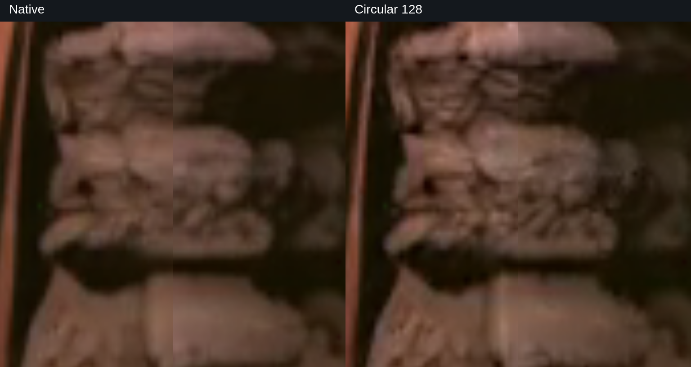
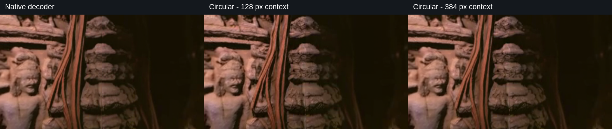
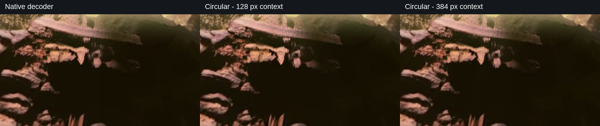

# H3 circular VAE decoding

Experimental v0.1: horizontal wrapped-context decoding for equirectangular video with MiniMax H3. Decode the **same final video latent** natively, or with neighboring columns copied across the left/right boundary before decoding.



[Comparison PDF](docs/H3-circular-decoding-comparison.pdf) · [Technique](docs/technique.md) · [Measurements](docs/evidence.md) · [Reproduction](docs/reproduce.md) · [Changelog](CHANGELOG.md)

```text
final H3 video latent
  -> [right-hand columns | original latent | left-hand columns]
  -> native H3 VAE decode
  -> crop added margins
  -> complete ERP video at its original dimensions
```

At H3's 16x spatial compression, 128 px context means 8 latent columns per side; 384 px means 24. The wider canvas changes both the available context and the native decoder's tile layout. This is a decoder intervention, without an additional diffusion pass.

## Visual comparisons

[Read the four-page comparison PDF](docs/H3-circular-decoding-comparison.pdf) for the full ERP context, technique, measurements and magnified views.

Same temple frame (97), centred on the wrap, at a 75-degree horizontal field of view. Left to right: native, circular 128, circular 384.

**Eye level**



**Looking up 45 degrees**



The [measurement page](docs/evidence.md) includes the downward view and both 20-degree close-ups. All views use matched projections of the saved PNG frames.

## Install and use

Install into an existing compatible PyTorch/ComfyUI model environment:

```sh
python -m pip install .
```

```python
import torch
from circular_decode import decode_circular

# Raw native MiniMaxH3VideoVAE, already loaded by the model environment.
# video_latent: video-only BCTHW tensor, in the raw VAE's normalization,
# on the decoder's device and dtype. Not a generic ComfyUI LATENT dictionary.
with torch.inference_mode():
    pixels = decode_circular(vae, video_latent, context_pixels=128)
```

For large videos, use the [CPU output-buffer example](examples/decode_saved_latent.py). This package does not load weights, submit cloud requests or provide a ComfyUI node. The raw decoder interface used in the experiments comes from ComfyUI revision `12d5279438bfefc058a269eae805ceab6047777f`.

## Evidence and scope

The matched forest and temple runs use 1536 x 672, 243 frames at 24 fps, 50 steps, BF16 H3 and our reviewed 360 LoRA at 1.0. Native VAE decoding uses FP16. In spherical review the join is visibly reduced, particularly in the temple. Boundary pixel mismatch falls about 28-31%; that is a diagnostic, not a percentage of perceptual improvement.

The original GPU harness produced these results. This extracted adapter has geometry, contract and CPU integration tests; the exact packaged callable has not yet been rerun against real H3 weights. It is an experimental source release, not a claim of universal seam removal. Refinement/upscaling, polar correctness and semantic consistency remain open.

```sh
python -m unittest discover -s tests -v
```

PyTorch tests skip when PyTorch is absent. Install/use the model environment's PyTorch to run them all.

The Python wheel contains `circular_decode` and `spherical_context`. Pole mappings in `spherical_context.py` and the separate `periodic_tiles.py` are experimental and are not used by `decode_circular`. The [optional viewer source](viewer/README.md) is separate from the adapter; its video assets are not in Git.

## License status

No license has been selected for the original project code yet. MIT is under consideration; this is not currently an MIT-licensed release. Bundled Three.js retains its [MIT notice](viewer/vendor/THREE-LICENSE.txt). Model weights and upstream model implementations are not included and retain their own terms.
