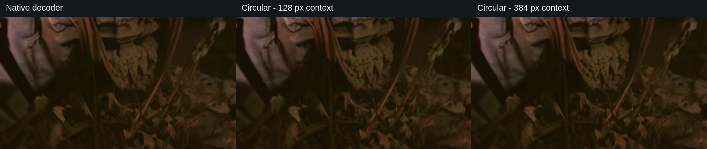
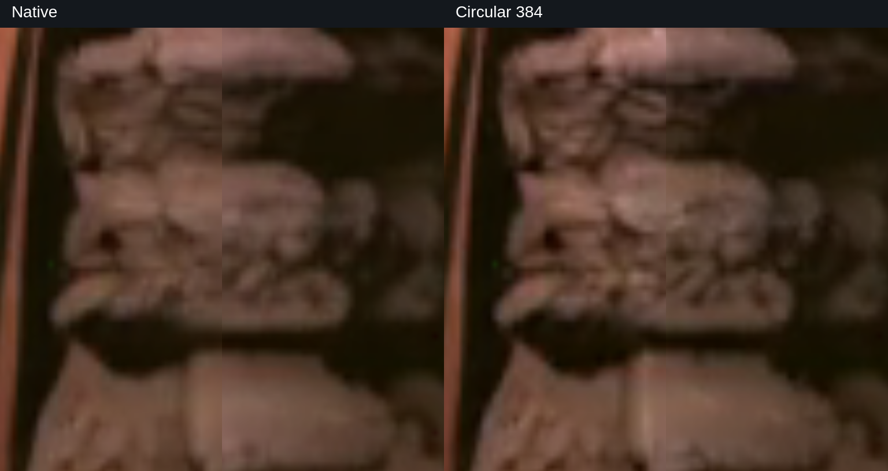

# Matched decoder evidence

Both examples use 1536×672, 243 frames, 24 fps, 50 ordinary diffusion steps and reviewed 360 LoRA 1.0. H3 weights BF16; native visual VAE FP16. All decoder arms within a scene share the exact saved video latent. All delivery videos decode, with file and latent SHA checks. [Machine-readable settings](../viewer/evidence.json).

| Scene | Decoder | Boundary MAE | Reduction vs native | Decode only |
|---|---|---:|---:|---:|
| forest | native | 12.212 | 0.0% | 13.23s |
| forest | circular128 | 8.375 | 31.4% | 14.84s |
| forest | circular384 | 8.591 | 29.7% | 19.94s |
| temple | native | 5.841 | 0.0% | 13.29s |
| temple | circular128 | 4.098 | 29.8% | 14.75s |
| temple | circular384 | 4.206 | 28.0% | 19.57s |

Values are RGB 0–255 diagnostics on decoded frames. Reductions are not percentages of perceptual improvement. Temporal boundary change and gradient detail are recorded separately in the machine-readable evidence. Wrapped variants change native tile layout; interior differences are expected.

The author reviewed the clips in the spherical viewer and judged the seam improvement visible, especially in the temple. These are positive examples, not a corpus-wide guarantee. Reproducing a previous hosted clip's camera trajectory is not a success requirement; no explicit camera-motion request was made in the temple prompt. The original hosted clip and current native generation differ in backend, LoRA version and duration, so they are not a controlled backend comparison.

128 px decoding added about 1.5–1.6 s over native here;384 px added about 6.3–6.7 s. Each 50-step sampling pass took about 22.7 minutes. This is decoder-only overhead on the measured H200 setup, not an end-to-end speed claim. Higher-resolution refinement and other upscalers have not yet been tested.

## Visual evidence

[Short A/B walkthrough (24.5 s)](media/h3-seam-walkthrough.mp4) - cropped screen recording, with the displayed decoder identified at each switch. The viewpoint moves and playback advances; the stills below provide fixed-frame comparisons.

[Full comparison PDF](H3-circular-decoding-comparison.pdf)

All stills show temple frame 97. The original ERP boundary is centred in each perspective panel, with identical projection and resampling across decoder arms.

### 75-degree view: eye level

### 75-degree view: looking up 45 degrees

### 75-degree view: looking down 45 degrees

### 20-degree close-up: native and circular 128

### 20-degree close-up: native and circular 384

