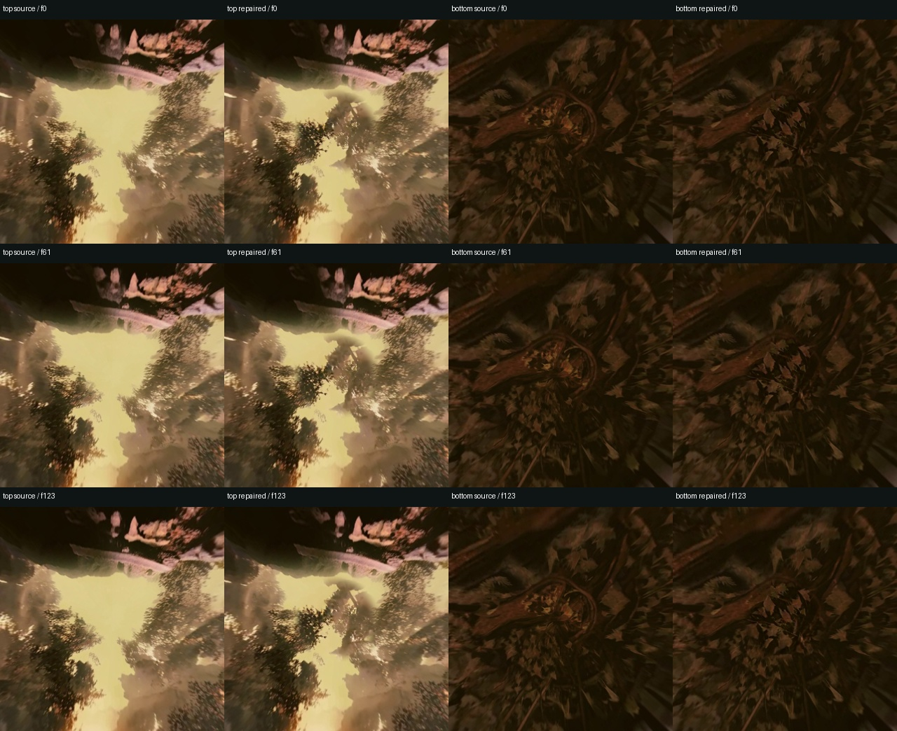
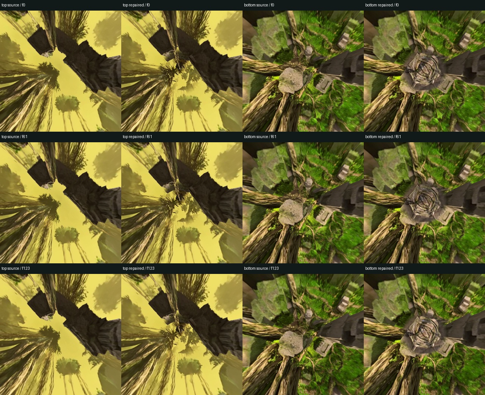

# Service validation — 9 September 2026

The clean wheel was deployed on fal H200 without imports from the research
workspace. This validates the packaged implementation separately from the
older experimental controllers.

## Existing-video repair

The input is a declared 124-frame excerpt of the original temple ERP at
1536×672 and 24 fps, stored losslessly before submission. Both poles use the
same short instruction, **Repair the polar distortion.**, with the small mask,
32 repair steps, seed 2026090911, and no geometry preprocessing or 360 LoRA.

Columns: original top, repaired top, original bottom, repaired bottom. Rows:
first, middle and last frame. The top retains the yellow sky. The centre of the
canopy is regenerated into more connected foliage; the ground's central radial
structure is replaced with new leaves/roots. These are content changes, not an
exact restoration of unseen ground truth. Residual convergence and texture
softness remain; three sampled frames do not establish universal temporal
stability.

All 124 lossless ERP frames were checked. Changed pixels are restricted to rows
0–81 and 591–671; rows 82–590 remain exactly equal to the submitted video.
Each perspective composite is also pixel-identical outside the 22-degree mask.
The downloaded lossless master matches its recorded SHA-256. Source views,
repaired views and both sampled latents are backed up locally.

The request took 596.07 seconds, including model loading, fresh text encoding,
both pole repairs and exports. This timing excludes server startup.

The service's projection differs slightly from the older experiment's input
(approximately 3.38 RGB levels on a 0–255 scale in the top-view comparison).
Local and worker FFmpeg versions differ too. This is evidence for the packaged
path, not a pixel-exact replay of the older prompt ablation.

## Native generation and operational validation

The persistent endpoint generated 1536×672, 124 frames at 50 steps, plus the
final shifted evaluation. With circular context held at 128 pixels, boundary
MAE fell from 10.9659 to 7.9929 (27.1%). The opposite middle half is pixel-exact
across all 124 frames. Both poles then completed 32-step repair with the default short instruction.
The complete API request took **1066.00 seconds (17.77 minutes)**, excluding
worker startup. Native sampling accounted for 450.96 seconds; top/bottom repair
sampling accounted for 47.05 and 56.96 seconds. Model loading, text encoding,
VAE work, projection, composition, hashing and exports account for the rest.

The top retains the yellow lighting and replaces the central convergence with
foliage. The bottom invents a concentric stone detail. It persists through the
three sampled frames, but is a conspicuous new structure; this is not evidence
of universally better geometry or faithful restoration. The small repair does
not address stretched content farther outside its mask.

All 124 lossless frames decode. Both pole composites preserve their exterior
pixels exactly, and the ERP middle half remains unchanged by repair. Generation
master hashes match the artifact manifest; final repair master matches its
receipt. Complete before/after ERPs and sampled latents are retained.

The CPU suite passes 30 tests, including real child-process cancellation. A
built wheel imports outside the checkout. The historical quantized small mask
is exact, and the extracted masked-sampler tensor operations match the tested
research kernel. These checks supplement the actual GPU validation above.

## Deployment and delivery

The existing-video request with both repairs disabled also passed: the receipt
contains no generation or repair stage, and final/comparison MP4 hashes match.
It ran after scale-to-zero on a fresh worker. The complete validation used
**$2.99 estimated compute**, including failed startup attempts and recovery, at
$4.50 per H200-hour. This is a runtime estimate, not an invoice. All validation
workers were verified stopped; the deployed app has no warm minimum.

A synchronous response was initially lost after successful execution. The saved
result was recovered without resubmitting inference; later requests used fal's
durable queue. The final wrapper explicitly labels video and JSON MIME types.
That delivery-only follow-up was checked against the CDN; all nine inference
Python modules are byte-identical to the GPU-tested wheel. The 30 CPU tests
also pass on the final source.

The endpoint is **`shamanicvocalarts/h3-spherical`**, currently private. fal
rejected shared publishing with **Cannot deploy shared applications**. A fal
admin must enable shared applications on this account before another account
can call it with its own key. No account key is included in this repository.
The queue API was validated; browser Playground interaction was not verified.

[Machine-readable validation summary](service-validation.json).
